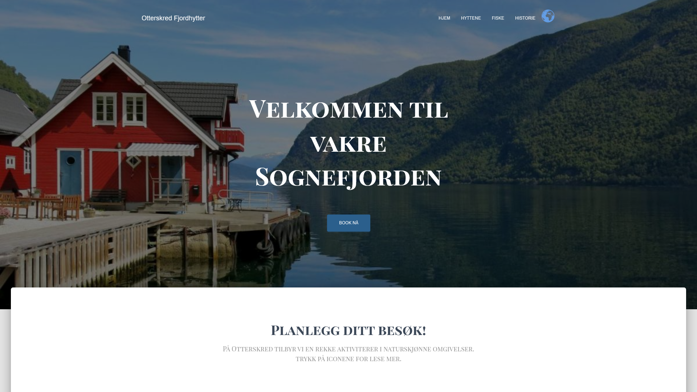

# Otterskred Fjordhytter
https://otterskred.petrine.no/

A simple overview of the use/purpose of the project.

## Description

Otterskred Fjord Cabins - A Wordpress Project

Erland Heen Halvorsen and I, through our student enterprise KlarKode, undertook a collaborative project with Agency1 at school. We chose to work with an external client. Our client rents out fjord cabins with access to fishing and other activities. The task was to redesign their website. Our client desired a more modern website that could be used in Norwegian, English, and German. This was one of the key elements we focused on.

Their old website had a form that we are scheduled to redesign this summer. It was discovered at the last minute that the form would be lost when transferring the domain, so it is still hosted on my domain.

## Built With

You can list a the tech stack that you've used over here
- Figma 
- Wordpress

## Contact

This is where you can leave your social links for people to contact you, such as a LinkedIn profile or 
Github.

[My LinkedIn page](https://www.linkedin.com/in/petrine-lynghaug/)